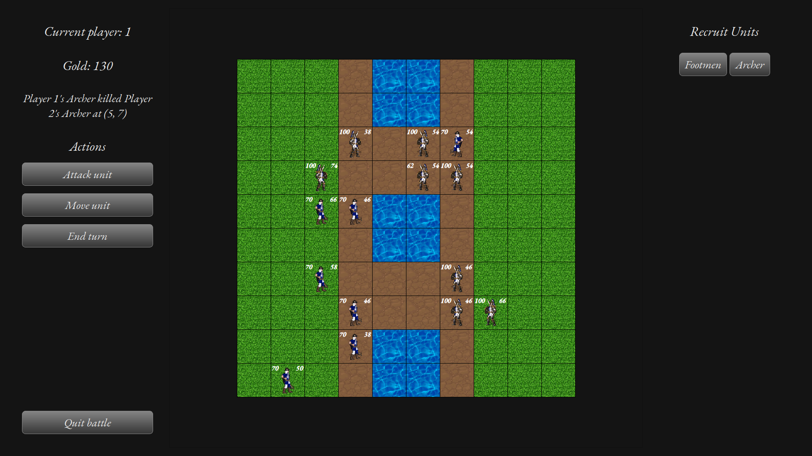

# myGame — Turn-Based Tactics in the Spirit of Heroes of Might and Magic



A turn-based strategy/tactics game built with C++ and Qt, developed as a semester project at Warsaw University of Technology ("12. Gry wojenne" — battle simulator assignment).

## Problem

The goal was to design and implement a turn-based tactical battle system inspired by *Heroes of Might and Magic* — players recruit units, manage a roster, and resolve battles turn by turn on a grid, with a full menu and settings layer around the core gameplay loop.

Beyond the gameplay logic itself, the project doubled as an exercise in object-oriented architecture: designing a class hierarchy and a set of collaborating systems (turn/state management, map/pathfinding, rendering, a simple AI opponent) that stays clean as features get added, rather than one that has to be reworked with every new mechanic.

## Status

The game is playable end to end: main menu → battle setup (starting gold, unit limit, hot-seat or vs-AI, map layout) → recruit units into per-player deployment zones → move and attack across turns, with morale and a random luck factor affecting combat → win by reaching the opponent's deployment zone → a result screen with per-player stats and the full combat log.

Both a human-vs-human (hot-seat) and a human-vs-AI mode are supported (`GameMode`, chosen in Battle Settings). There is no separate rendering layer (no `MainRenderer`/`GUIRenderer`) — screens are plain Qt widgets that lay themselves out and paint through normal Qt/QGraphicsView mechanisms.

Not yet implemented: settings/battle-settings persistence to disk (values are in-memory only), cover/barricades (`TileType::barricade` exists but has no gameplay effect yet), and any "one action per turn" cap on movement (movement is intentionally budget-based via unit speed, not capped to a single move — see `Notes.md`).

## Architecture

**Screen shell & navigation:**

- **`MainWidget`** — the top-level window. Owns a `QStackedWidget` holding every screen, owns the `Setting`/`BattleSetting` instances, and switches pages via the `switchScreen(Screen)` slot.
- **`BaseScreenWidget`** — common base class for full-page screens. Declares a `screenChanged(Screen)` signal and a `navigateTo(Screen)` slot, so a screen can ask to switch pages without knowing about the stack itself.
- **`MenuWidget`, `BattleMenuWidget`** — concrete screens derived from `BaseScreenWidget`. `BattleMenuWidget` is the pre-battle menu (start battle / battle settings / back) and owns the `createBattle()` slot that builds a `Map` + `Battle` and hands them to `BattleWidget` via the `battleCreated` signal.
- **`SettingsWidget`, `BattleSettingsWidget`** — `QDialog` subclasses that edit general/battle settings and write the results back through `Setting`/`BattleSetting` setters.
- **`Setting`, `BattleSetting`** — plain data holders (getters/setters) for configurable values. `Setting` holds window resolution; `BattleSetting` holds starting gold, max unit count, `GameMode` (hot-seat/vs-AI), and `mapType` (which predefined map layout to load). In-memory only; no file persistence yet.

**Battle screen & turn logic:**

- **`BattleWidget`** — the in-battle screen. Hosts `ShopWidget`, `ActionWidget`, and `MapWidget`. `setBattle(Battle*, BattleSetting*)` is where `TurnHandler` and `MapWidget` actually get constructed, and — when `GameMode::VsAI` is selected — where an `AIHandler` is created and handed to `TurnHandler`. The `battleEnded` slot shows the result screen and tears the map down so the next battle starts from a clean state.
- **`TurnHandler`** — owns the two `Player`s, the current player, and `ActionMode` (None/RecruitUnit/MoveUnit/AttackUnit). Implements the actual game actions: `confirmUnitDeployment`, `moveUnit`, `attackUnit`, `endTurn` (switches player, refreshes the new current player's units, clears the map's selection state, and — if the new current player is AI-controlled — hands the turn to `AIHandler::executeTurn`). Emits `battleEnded(const Player* winnerPtr)` once a unit reaches the opposing deployment zone. Owns a `Logger` recording every move/attack/kill/recruit event.
- **`AIHandler`** — drives one player's turn automatically with a simple heuristic (no costmap/lookahead): deploy new units near the front, attack any enemy already in range, otherwise move toward the enemy deployment zone, then attack again if possible. Uses `MapHandler`'s pathfinding queries with an `ignoreUnits` option so its own units don't block its distance heuristics. Pauses briefly between actions (`QEventLoop`/`QTimer::singleShot`, not a blocking sleep) so the GUI stays responsive and the moves are visible.
- **`ActionWidget`** — the in-battle action bar (Move unit / Attack unit / End turn buttons) plus the current player/gold display and the live combat-log line.
- **`ShopWidget`** — unit-recruitment UI; emits `unitPurchaseRequested(UnitType)`. Purchases are gated by both gold and the battle's unit-count limit.
- **`Player`** — per-player state: gold, owned `Unit`s, running `PlayerStats` (frags/casualties/damage dealt/received/units recruited), and a deployment `startColumn_` (player 1 spawns near column 0, player 2 near the last column).
- **`Message`, `MoveMessage`/`AttackMessage`/`KillMessage`/`RecruitMessage`, `Logger`** — a small polymorphic event hierarchy (`Message::describe() const`) recording the battle's course; `Logger` owns the ordered log and is displayed both live (via `ActionWidget`) and in full on the result screen.
- **`ResultWidget`** — end-of-battle `QDialog`: winner, a side-by-side stats grid for both players, and the full combat log.

**Map, placement & rendering:**

- **`MapWidget`** (`QGraphicsView`) — owns the `QGraphicsScene`, builds the `TileWidget` grid, and handles all mouse input (`onTileHovered`/`onTileLeft`/`onTileClicked`) and tile painting (`paintTile`, `restoreTileColor`, terrain sprites from `img/`). It drives a `MapHandler` for anything that isn't "put a color/sprite on a tile."
- **`MapHandler`** — bridges game logic and the Qt UI layer: owns the reachability/targeting queries (`findMovePaths`/`findTargets`, backed internally by `Finder`), the `Tile`↔`TileWidget` and `Unit`↔`UnitWidget` lookup tables, morale calculation (`calculateMorale`), and the current selection state (which unit is selected, which tile it started from, which tiles/targets are currently highlighted) as pure data — no painting. Also hosts the project's custom (non-STL) template, `clampValue<T>`.
- **`Finder`** — weighted BFS/Dijkstra-style reachability. `findMovePaths` respects a unit's remaining speed, per-tile movement cost (`Tile::getSpeedImpact()` — grass costs 1, mud costs 2), and `Tile::isPassable()` (impassable tiles, e.g. water, are excluded from the search graph entirely, not just visually); an `ignoreUnits` flag lets a caller treat occupied tiles as passable for pure distance heuristics (used by `AIHandler`). `FindTargets` finds enemy-occupied tiles within a unit's attack range.
- **`Map`, `Tile`, `TileWidget`** — the grid model (`Map` holds all `Tile`s and neighbour lookups, built from a predefined `mapType` layout — see `mapTiles.hpp`) and its `QGraphicsRectItem` visual (`TileWidget`). `Tile::isWithinDeploymentZone(Player*)` gates recruitment to columns near a player's spawn. `Tile`/`Unit` have no knowledge of `TileWidget`/`UnitWidget` at all — `MapHandler` owns the reverse lookups, keeping game logic independently buildable/testable from the Qt UI layer.
- **`Unit`, `UnitWidget`, `Player`** — `Unit` holds mutable per-battle state (`remainingSpeed_`, `remainingHealth_`, `hasAttacked_`, `morale_`) separate from the immutable `UnitStats` table, plus its owning `Player` (`ownerPtr_`, used to filter valid move/attack targets to the current player's own units and enemy units respectively). `UnitWidget` (`QGraphicsPixmapItem`, parented to its current `TileWidget`) renders a sprite (from `img/`, per unit type and owning player) plus live health and morale labels; on death it swaps to a "dead" sprite and is removed a moment later via `QTimer::singleShot` rather than immediately, so the death is actually visible.

## Requirements

- Qt5 (`Widgets` module)
- C++20
- CMake 3.16+
- Doxygen (optional, only for regenerating documentation — see below)

## Building

```bash
git clone <repo-url>
cd myGame
mkdir build && cd build
cmake ..
make
```

`CMAKE_AUTOMOC`/`AUTOUIC`/`AUTORCC` are enabled, so Qt's moc/uic/rcc steps run automatically — no manual wrapping needed for new widgets. The binary (`build/myGame`) expects to be run from `build/` — it loads sprites via the relative path `../img/...`.

## Documentation

Every public class and method in `src/` is documented with Doxygen comments (`@brief`/`@param`/`@return`). To generate browsable HTML docs:

```bash
sudo apt install doxygen   # if not already installed
doxygen Doxyfile
```

Output lands in `docs/html/index.html` (both `Doxyfile`'s output and the generated `docs/` folder are gitignored — they're a local build artifact, not source).

## Repo structure

All source lives flat under `src/`; `CMakeLists.txt` sits at the repo root and lists every `.cpp` explicitly (no globbing).

```
.
├── CMakeLists.txt
├── Doxyfile                               # Doxygen config (see Documentation above)
├── README.md
├── Notes.md
├── img                                     # tile/unit sprites (PNG), loaded at runtime
└── src
    ├── game.cpp                             # entry point
    ├── mainWidget.cpp / .hpp                # top-level window, owns the QStackedWidget screen stack
    ├── baseScreenWidget.cpp / .hpp          # shared base for full-page screens
    ├── screen.hpp                            # Screen enum used for navigation
    │
    ├── menuWidget.cpp / .hpp                # main menu screen
    ├── battleMenuWidget.cpp / .hpp          # pre-battle menu screen (creates the Battle)
    ├── settingsWidget.cpp / .hpp            # QDialog for general settings
    ├── battleSettingsWidget.cpp / .hpp      # QDialog for battle settings
    ├── settings.cpp / .hpp                  # general settings data holder
    ├── battleSettings.cpp / .hpp            # battle-specific settings data holder
    ├── gameMode.hpp                          # GameMode enum (HotSeat/VsAI)
    │
    ├── battle.cpp / .hpp                    # owns a Map + BattleSetting for one battle
    ├── battleWidget.cpp / .hpp              # in-battle screen: hosts MapWidget, ActionWidget, ShopWidget
    ├── turnHandler.cpp / .hpp               # turn/player state machine, action mode, move/attack/deploy
    ├── aiHandler.cpp / .hpp                 # simple heuristic AI, drives one player's turn
    ├── actionWidget.cpp / .hpp              # in-battle action bar (end turn, move unit, attack unit)
    ├── actionMode.hpp                        # ActionMode enum (None/RecruitUnit/AttackUnit/MoveUnit)
    ├── shopWidget.cpp / .hpp                # unit-recruitment shop UI
    ├── player.cpp / .hpp                    # per-player state (gold, units, deployment column)
    ├── playerStats.hpp                       # running battle statistics per player
    ├── resultWidget.cpp / .hpp              # end-of-battle dialog: winner, stats, combat log
    │
    ├── message.hpp                           # Message abstract base (combat log event)
    ├── moveMessage.cpp / .hpp               # combat log entry: unit moved
    ├── attackMessage.cpp / .hpp             # combat log entry: non-lethal attack
    ├── killMessage.cpp / .hpp               # combat log entry: lethal attack
    ├── recruitMessage.cpp / .hpp            # combat log entry: unit deployed
    ├── logger.cpp / .hpp                    # owns the ordered combat log
    │
    ├── map.cpp / .hpp                       # tile grid, neighbour lookup, built from a mapType layout
    ├── mapWidget.cpp / .hpp                 # QGraphicsView: rendering + mouse input
    ├── mapHandler.cpp / .hpp                # placement/selection state + pathfinding queries + custom template
    ├── mapTiles.hpp                          # hardcoded tile-layout presets (river, bog)
    ├── mapType.hpp                            # mapType enum (which preset to load)
    ├── tile.cpp / .hpp                      # single grid cell: type, occupant, deployment zone check
    ├── tileType.hpp                          # TileType enum (grass/water/mud/barricade)
    ├── tileWidget.cpp / .hpp                # QGraphicsRectItem for one tile
    ├── finder.cpp / .hpp                    # weighted BFS reachability (movement) + targeting (attack range)
    │
    ├── unit.cpp / .hpp                      # unit stats/state (speed, health, hasAttacked, morale, owner)
    ├── unitStats.hpp                         # UnitStats struct + per-UnitType stat table
    ├── unitType.hpp                          # UnitType enum
    └── unitWidget.cpp / .hpp                # QGraphicsPixmapItem for one unit: sprite + health/morale labels
```

Class names use PascalCase (`MainWidget`, `TurnHandler`, `UnitWidget`, ...); member variables use camelCase with a trailing underscore (`settingsPtr_`, `unitSelected_`, ...). Methods within a class are ordered general/action methods first, then setters (`setXxx`), then getters (`getXxx`) last, in both the header and the source file.

## Author

Antoni Biskupski — Warsaw University of Technology, Automation, Robotics and Industrial Computer Science
